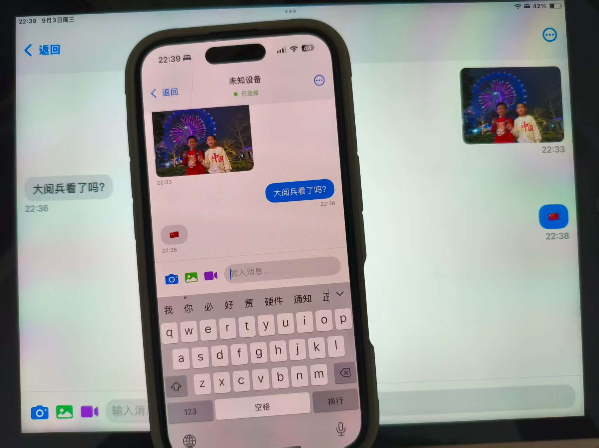

# BLE Chat iOS 应用

基于SwiftUI和Core Bluetooth框架开发的蓝牙低功耗聊天应用，支持与Android设备进行跨平台通信。

## 📱 应用特性

- **现代UI设计**: 使用SwiftUI构建的原生iOS界面
- **跨平台通信**: 与Android BLE Chat应用完全兼容
- **实时消息**: 支持文本消息和图片传输
- **设备发现**: 自动扫描和连接附近的BLE设备
- **分片传输**: 支持大文件的分片传输机制
- **二进制优化**: 图片采用二进制传输，避免Base64编码开销

## Screenshots



## 🛠 技术栈

- **UI框架**: SwiftUI
- **蓝牙通信**: Core Bluetooth
- **响应式编程**: Combine
- **架构模式**: MVVM
- **最低版本**: iOS 14.0+ / macOS 11.0+

## 📋 系统要求

### 开发环境
- **Xcode**: 14.0 或更高版本
- **macOS**: 12.0 (Monterey) 或更高版本
- **Swift**: 5.7+

### 运行环境
- **iOS**: 14.0+ (iPhone/iPad)
- **macOS**: 11.0+ (Mac with Apple Silicon/Intel)
- **蓝牙**: 支持BLE 4.0+的设备

## 🏗 项目结构

```
BLE_Chat/
├── BLE_ChatApp.swift           # 应用入口点
├── ContentView.swift           # 主界面视图
├── ChatView.swift              # 聊天界面
├── DeviceListView.swift        # 设备列表界面
├── BLEChatManager.swift        # BLE通信核心管理器
├── BLEProtocol.swift           # 通信协议定义
├── BLE_Chat.entitlements       # 应用权限配置
└── Assets.xcassets/            # 应用资源文件
    ├── AppIcon.appiconset/     # 应用图标
    └── AccentColor.colorset/   # 主题色彩
```

## 🔧 安装与运行

### 1. 克隆项目
```bash
git clone <repository-url>
cd BLE_Chat/ble_-chat_i-os
```

### 2. 打开项目
```bash
open BLE_Chat.xcodeproj
```

### 3. 配置项目
1. 在Xcode中选择你的开发团队
2. 修改Bundle Identifier为唯一标识符
3. 确保选择了正确的部署目标

### 4. 运行应用
- 选择目标设备（iOS设备或模拟器）
- 点击运行按钮 (⌘+R)

## ⚙️ 权限配置

### Info.plist 配置
应用需要在Info.plist中添加以下权限描述：

```xml
<key>NSBluetoothAlwaysUsageDescription</key>
<string>此应用需要使用蓝牙来与其他设备进行聊天通信</string>

<key>NSBluetoothPeripheralUsageDescription</key>
<string>此应用需要使用蓝牙外设功能来接收其他设备的连接</string>
```

### Entitlements 配置
macOS版本需要在entitlements文件中配置沙盒权限：

```xml
<key>com.apple.security.app-sandbox</key>
<true/>
<key>com.apple.security.files.user-selected.read-only</key>
<true/>
```

## 🏛 核心架构

### BLEChatManager
应用的核心BLE通信管理器，负责：

```swift
class BLEChatManager: NSObject, ObservableObject {
    // 发布的状态属性
    @Published var connectionState: BLEConnectionState
    @Published var discoveredDevices: [CBPeripheral]
    @Published var receivedMessages: [ChatMessage]
    
    // 核心功能
    func startScanning()           // 开始扫描设备
    func startAdvertising()        // 开始广播
    func connect(to peripheral:)   // 连接到设备
    func sendMessage(_:)          // 发送消息
}
```

### 消息模型
```swift
struct ChatMessage: Identifiable, Codable {
    let id: UInt32
    let type: MessageType
    let content: String
    let timestamp: TimeInterval
    let isFromCurrentUser: Bool
    let imageData: Data?
    
    enum MessageType: String, Codable {
        case text = "text"
        case image = "image"
    }
}
```

### BLE协议定义
```swift
struct BLEProtocol {
    // 服务和特征UUID
    static let chatServiceUUID = CBUUID(string: "12345678-1234-1234-1234-123456789ABC")
    static let messageCharacteristicUUID = CBUUID(string: "87654321-4321-4321-4321-CBA987654321")
    
    // 消息头结构 (25字节)
    static let HEADER_SIZE = 25
    static let MAX_CHUNK_SIZE = 512
}
```

## 🔄 通信协议

### 消息头格式 (25字节)
```
字节 0:     协议版本 (0x01)
字节 1:     消息类型 (0x01=文本, 0x02=图片)
字节 2-5:   消息ID (4字节, 大端序)
字节 6-9:   时间戳 (4字节, 大端序)
字节 10-13: 分片索引 (4字节, 大端序)
字节 14-17: 总分片数 (4字节, 大端序)
字节 18-19: 载荷长度 (2字节, 大端序)
字节 20-23: CRC32校验 (4字节, 大端序)
字节 24:    保留字节
```

### 数据格式

#### 文本消息
```json
{
  "id": 1,
  "type": "text",
  "content": "Hello World",
  "timestamp": 1693747200000,
  "isFromCurrentUser": true
}
```

#### 图片消息
```
[2字节: 元数据长度] + [元数据JSON] + [图片二进制数据]
```

## 🧪 测试指南

### 单元测试
```bash
# 运行单元测试
⌘+U 或者 Product → Test
```

### 功能测试

#### 1. 蓝牙功能测试
- [ ] 应用启动时正确检测蓝牙状态
- [ ] 扫描功能能发现附近BLE设备
- [ ] 广播功能能被其他设备发现
- [ ] 连接建立和断开正常工作

#### 2. 消息传输测试
- [ ] 文本消息发送和接收
- [ ] 长文本消息的分片传输
- [ ] 图片消息的二进制传输
- [ ] CRC校验正确工作

#### 3. UI测试
- [ ] 设备列表正确显示扫描结果
- [ ] 聊天界面消息正确显示
- [ ] 连接状态正确反映
- [ ] 错误提示正确显示

### 性能测试
- **内存使用**: 监控大图片传输时的内存占用
- **传输速度**: 测量不同大小文件的传输时间
- **电池消耗**: 长时间使用的电池影响

## 🐛 故障排除

### 常见问题

#### 1. "蓝牙不可用"
**原因**: 设备不支持蓝牙或蓝牙未开启
**解决方案**:
- 检查设备是否支持蓝牙
- 在系统设置中开启蓝牙
- 重启应用

#### 2. "无法发现设备"
**原因**: 权限问题或蓝牙干扰
**解决方案**:
- 确认蓝牙权限已授予
- 检查目标设备是否在广播模式
- 减少蓝牙干扰源

#### 3. "连接失败"
**原因**: 设备距离过远或信号干扰
**解决方案**:
- 确保设备距离在10米内
- 避免障碍物阻挡
- 重新扫描和连接

#### 4. "消息发送失败"
**原因**: 连接不稳定或数据过大
**解决方案**:
- 检查连接状态
- 重新建立连接
- 检查消息大小是否超限

### 调试技巧

#### 1. 控制台日志
在Xcode控制台中查看详细日志：
```
iOS: BLE Manager initialized
iOS: Starting scan for devices
iOS: Discovered device: iPhone
iOS: Connected to device successfully
iOS: Sending message: Hello
```

#### 2. 蓝牙调试
使用Additional Tools for Xcode中的Bluetooth Explorer：
- 监控BLE连接状态
- 查看服务和特征
- 分析信号强度

#### 3. 网络调试
```swift
// 在BLEChatManager中添加调试日志
print("iOS: Received chunk (\(data.count) bytes): \(data.map { String(format: "%02X", $0) }.joined(separator: " "))")
```

## 🔧 开发配置

### Xcode项目设置

#### Build Settings
- **Deployment Target**: iOS 14.0 / macOS 11.0
- **Swift Language Version**: Swift 5
- **Code Signing**: 自动管理签名

#### Capabilities
- **Background Modes**: 
  - Uses Bluetooth LE accessories
  - Acts as a Bluetooth LE accessory

#### Framework Dependencies
```swift
import SwiftUI
import CoreBluetooth
import Combine
import Foundation
```

### 代码规范

#### Swift代码风格
- 使用4空格缩进
- 遵循Swift API设计指南
- 使用有意义的变量和函数名
- 添加适当的注释和文档

#### 示例代码格式
```swift
// MARK: - Public Methods
func startScanning() {
    guard centralManager?.state == .poweredOn else {
        print("iOS: Bluetooth not ready for scanning")
        return
    }
    
    centralManager?.scanForPeripherals(
        withServices: [BLEProtocol.chatServiceUUID],
        options: [CBCentralManagerScanOptionAllowDuplicatesKey: false]
    )
    
    isScanning = true
    print("iOS: Started scanning for devices")
}
```

## 📈 性能优化

### 内存管理
- 使用`weak`引用避免循环引用
- 及时释放大型数据对象
- 监控内存使用情况

### 电池优化
- 合理设置扫描间隔
- 连接建立后停止扫描
- 使用低功耗模式

### 传输优化
- 实现智能重传机制
- 优化分片大小
- 使用压缩算法

## 🚀 部署指南

### App Store 部署
1. **准备工作**
   - 配置App Store Connect
   - 准备应用图标和截图
   - 编写应用描述

2. **构建发布版本**
   ```bash
   # 在Xcode中选择Generic iOS Device
   # Product → Archive
   ```

3. **上传到App Store**
   - 使用Xcode Organizer上传
   - 或使用Application Loader

### TestFlight 测试
1. 上传构建版本到App Store Connect
2. 添加测试用户
3. 发送测试邀请

## 📚 相关资源

### Apple官方文档
- [Core Bluetooth Programming Guide](https://developer.apple.com/library/archive/documentation/NetworkingInternetWeb/Conceptual/CoreBluetooth_concepts/)
- [SwiftUI Tutorials](https://developer.apple.com/tutorials/swiftui)
- [Combine Framework](https://developer.apple.com/documentation/combine)

### 第三方资源
- [BLE开发最佳实践](https://punchthrough.com/core-bluetooth-guide/)
- [iOS蓝牙开发指南](https://www.raywenderlich.com/231-core-bluetooth-tutorial-for-ios-heart-rate-monitor)

## 🤝 贡献指南

1. Fork项目到你的GitHub账户
2. 创建功能分支: `git checkout -b feature/new-feature`
3. 提交更改: `git commit -am 'Add new feature'`
4. 推送到分支: `git push origin feature/new-feature`
5. 创建Pull Request

### 代码审查清单
- [ ] 代码符合Swift风格指南
- [ ] 添加了适当的单元测试
- [ ] 更新了相关文档
- [ ] 通过了所有现有测试

## 📄 许可证

本项目采用MIT许可证 - 查看[LICENSE](../LICENSE)文件了解详情。

## 📞 支持与反馈

- **问题报告**: [GitHub Issues](https://github.com/buld-your-own-x-with-ai/BLE_Chat_iOS/issues)
- **功能请求**: [GitHub Discussions](https://github.com/buld-your-own-x-with-ai/BLE_Chat_iOS/discussions)
- **技术支持**: 发送邮件至 iosdevlog@iosdevlog.com

---

**注意**: 本应用仅用于学习和研究目的。在生产环境中使用前，请确保充分测试并遵循Apple的应用审核指南。
